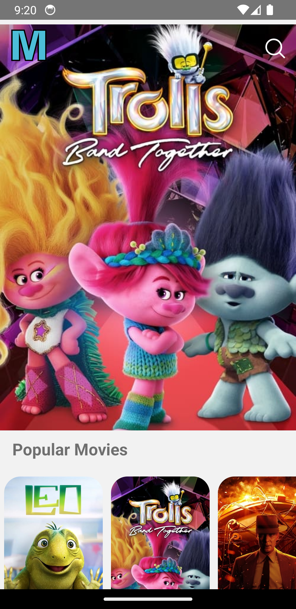
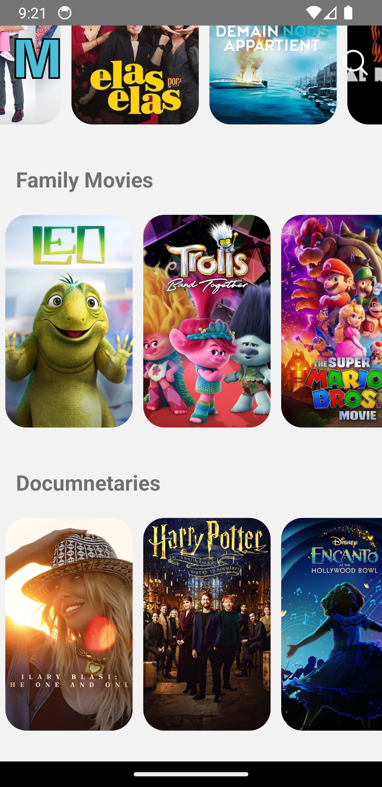
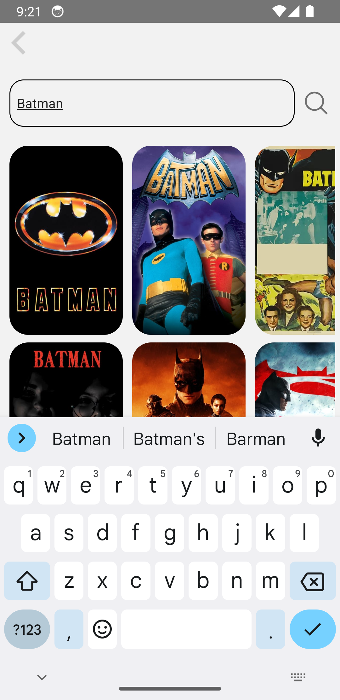

# Movie App Readme

Welcome to the Movie App, a React Native project that allows users to explore a vast catalog of movies using The Movie Database (TMDb) API.

## Features

1. **View Movie Catalogs:** Browse through an extensive collection of movies, each with detailed information.

<p align="center">
    
    
</p>

2. **Search Functionality:** Easily find your favorite movies by using the search feature.

<p align="center">
    
</p>

3. **Movie Details:** Navigate to specific movies to access comprehensive details, including genre, rating, description, and release date.

<p align="center">
    
</p>

4. **Play Button:** Watch a demo video showcasing the immersive viewing experience and player functionality in both landscape and portrait modes

<p align="center">
    
</p>

## Getting Started

To run the Movie App on your local machine, follow these steps:

1. **Clone Repository:**

```bash
git clone https://github.com/NemanjaDobranic/movie-app.git
```

2. **Install Dependencies:**

```bash
cd movie-app
npm install
```

3. **Configure View Prop Types**
   To enable ViewPropTypes in React Native version 0.70 and above, follow these steps:

- Use the following command to install the deprecated prop types package:

```bash
npm i deprecated-react-native-prop-types
```

- In the **`index.js`** file located in the **`react-native`** folder inside the **`node_modules`**, make the following changes:

Replace the existing code:

```js
  // Deprecated Prop Types
   get ColorPropType(): $FlowFixMe {
    invariant(
      false,
      'ColorPropType has been removed from React Native. Migrate to ' +
        "ColorPropType exported from 'deprecated-react-native-prop-types'.",
    );
    return require('deprecated-react-native-prop-types').ColorPropType
   },
   get EdgeInsetsPropType(): $FlowFixMe {
    invariant(
      false,
      'EdgeInsetsPropType has been removed from React Native. Migrate to ' +
        "EdgeInsetsPropType exported from 'deprecated-react-native-prop-types'.",
    );
    return require('deprecated-react-native-prop-types').EdgeInsetsPropType
   },
   get PointPropType(): $FlowFixMe {
    invariant(
      false,
     'PointPropType has been removed from React Native. Migrate to ' +
        "PointPropType exported from 'deprecated-react-native-prop-types'.",
    );
   return require('deprecated-react-native-prop-types').PointPropType
   },
   get ViewPropTypes(): $FlowFixMe {
    invariant(
      false,
      'ViewPropTypes has been removed from React Native. Migrate to ' +
        "ViewPropTypes exported from 'deprecated-react-native-prop-types'.",
    );
    return require('deprecated-react-native-prop-types').ViewPropTypes
   },

```

with:

```js
 // Deprecated Prop Types
  get ColorPropType(): $FlowFixMe {
    return require('deprecated-react-native-prop-types').ColorPropType

  },
  get EdgeInsetsPropType(): $FlowFixMe {
    return require('deprecated-react-native-prop-types').EdgeInsetsPropType

  },
  get PointPropType(): $FlowFixMe {
    return require('deprecated-react-native-prop-types').PointPropType

  },
  get ViewPropTypes(): $FlowFixMe {
    return require('deprecated-react-native-prop-types').ViewPropTypes
  },
```

4. **Configure API Key:**
   Obtain an API key from [The Movie Database (TMDb)](https://developer.themoviedb.org/docs) and replace **apiKey** value in the _movie-app/services/services.js_ file with your actual API key.

5. **Explore and Enjoy:**
   Open the app on your emulator or physical device and start exploring the world of movies!

## License

This project is licensed under the [MIT License](https://opensource.org/license/mit/). You are free to use, modify, and distribute it as per the terms of the license.
